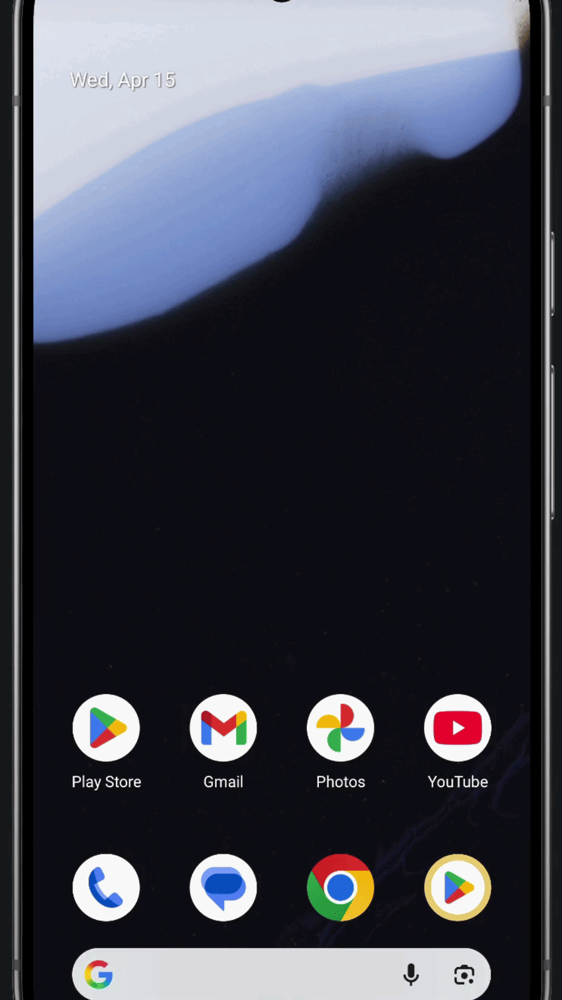

# GymRat

GymRat is an Android application designed to help users track their workouts, monitor their progress, and stay motivated with features like XP gains, streaks, and step tracking.

## Features

- **Workout Tracking:** Log your daily exercises and routines.
- **XP & Leveling:** Earn XP for your workouts and daily activities.
- **Step Counter:** Integrates with Android's activity recognition to track your steps.
- **Routine Management:** Organize your workouts by day and muscle group.
- **History:** View your past workout sessions and progress.
- **Leaderboard:** Compete with others (Coming Soon).

## Tech Stack

- **Language:** Kotlin
- **UI Framework:** Jetpack Compose
- **Architecture:** MVVM (Model-View-ViewModel)
- **Database/Backend:** Firebase (Firestore)
- **Local Storage:** DataStore Preferences

## Getting Started

### Prerequisites

- Android Studio Koala or newer.
- JDK 17 or higher.

### Setup

1. Clone the repository:
   ```bash
   git clone https://github.com/[YOUR_USERNAME]/gymrat.git
   ```
2. Open the project in Android Studio.
3. Add your `google-services.json` file to the `app/` directory.
4. Sync the project with Gradle files.
5. Run the app on an emulator or a physical device.

## 🎥 Demo



